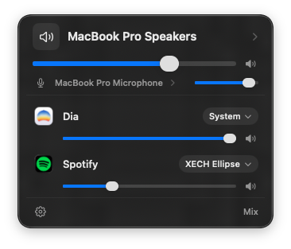

# Mix

[](https://github.com/ion05/mix/releases/latest/download/Mix.dmg)
[](https://github.com/ion05/mix/releases/latest/download/Mix.zip)

A macOS menu bar app that sends each app's audio to whichever output device you
choose. Take the call on your AirPods while the music keeps playing through the
speakers.

macOS lets you pick one output device for the entire system. Mix gives you one
per app, from a Control Center style panel in the menu bar.

<p align="center">
  
</p>

<p align="center">
  <em>Spotify on the Bluetooth speaker, Dia following the system output. Two apps,
  two devices, at the same time.</em>
</p>

## What it does

- **Per-app output.** Route Zoom to your headset and Spotify to your speakers at
  the same time.
- **Per-app volume and mute**, independent of the system volume.
- **System output and input** in the same panel, so you are not bouncing between
  Mix and System Settings.
- **Routes are remembered.** Quit Mix, reopen it, and your apps land back on the
  devices you chose.
- **Updates itself.** Choose *Check for Updates…* in the gear menu. Mix
  downloads the new version, swaps itself out, and relaunches, and your routes
  carry over.
- **Keeps system audio put.** Turn on *Keep System Audio When Devices Connect*
  in the gear menu and a speaker you connect only plays the apps pinned to it.
  macOS no longer moves your system output and microphone over to it.
- **Falls back gracefully.** Unplug the device an app was pinned to and its
  audio moves to the system output, with the panel saying so in amber rather
  than pretending nothing happened.

## Requirements

- macOS 26 or later
- Xcode 26 or later to build
- An Apple ID in Xcode for signing, free tier is enough

## Building

```
git clone https://github.com/<you>/mix.git
cd mix
open Mix.xcodeproj
```

In Xcode, select the Mix target, open Signing & Capabilities, and set Team to
your own. Change the bundle identifier from `com.aayanagarwal.mix` to something
under a domain you control. Then build and run.

If you ship your own builds, point `SUFeedURL` and `SUPublicEDKey` in
`Mix/Info.plist` at your own releases and Sparkle key. Otherwise *Check for
Updates…* offers the official Mix.

To release, raise Version and Build on the Mix target, then Archive,
notarize and export Mix.app. Run `scripts/release.sh path/to/Mix.app`, and
upload the DMG plus `build/release/Mix-<version>.zip` and `appcast.xml` to a
GitHub release tagged `v<version>`.

Mix appears in the menu bar. It has no Dock icon and no windows.

## Permission

Mix needs **System Audio Recording** the first time it taps an app. macOS asks
once, and the panel offers a repair shortcut into System Settings if the
permission is ever revoked.

The permission sounds broader than what Mix does with it. macOS routes a
specific app's audio somewhere else by capturing that app's output stream and
replaying it into the device you picked. That capture is what needs the
permission. Mix never records to disk and never sends audio anywhere.

## How it works

Mix is one process. There is no background helper and no daemon.

```
MixApp              MenuBarExtra, scroll-to-adjust, quit lifecycle
  MixerStore        main-actor state, 1s poll, Launch at Login
    AudioEngine     serial queue, owns every tap and aggregate device
      TapRoute      one process tap + aggregate device per routed app
      Devices       CoreAudio device enumeration and volume
      Processes     audio processes, resolved to their owning app
      HAL           typed CoreAudio property access
      Persistence   saved routes on disk
```

Routing one app works like this. `AudioHardwareCreateProcessTap` captures that
app's output with `CATapDescription`, muting the original stream. An aggregate
device is built with the destination as its main sub-device and the tap
attached. An IO proc copies the tapped audio into the destination, applying the
app's volume, which is where per-app volume and mute actually happen.

Two details worth knowing if you read the source:

**Audio processes are resolved to their owning app.** CoreAudio names the
process that opened the device, and for a Chromium or Electron app that is a
renderer helper with its own bundle identifier. Dia reports
`company.thebrowser.browser.helper.renderer`. `Processes.swift` walks the
process path to the outermost `.app` bundle, so the row says Dia and one route
taps every helper the app spawned.

**`HAL.get` takes the type explicitly.** Written the obvious way as
`try? HAL.get(device, selector)`, Swift resolves the generic parameter to
`Optional<UInt32>` rather than `UInt32`, asks CoreAudio for five bytes instead
of four, and leaves the optional's tag byte uninitialised. Every scalar property
read then returns the real value or nil at random. Naming the type at the call
site makes that impossible.

## Design

`DESIGN.md` is the source of truth for every visual decision: the 11 / 13 / 15
type scale, the 8 point spacing base, the semantic colours. The popover reads
all of it from `MixType`, `MixSpace`, `MixMetrics` and `MixPalette` at the top of
`Mix/Views/MixerPopover.swift`, so there are no loose numbers in the views.

The panel is meant to look like it shipped with macOS. System materials, the
user's accent colour, SF Pro only, no custom chrome.

## Known limitations

- **No per-app input device.** macOS exposes per-process audio properties as
  read-only, so there is no way to give one app a different microphone. Input is
  a single system-wide choice and the panel presents it that way.
- **AirPlay destinations are not supported.** Mix cannot clock an aggregate
  device against an AirPlay output, so those are excluded from the picker and a
  route to one reports an error rather than failing silently.
- **Browsers spawn and kill renderers constantly.** The set of processes Mix
  taps for a browser changes as you open and close tabs, which rebuilds the
  route. Audio may glitch briefly when that happens.
- **Keeping system audio put can undo a pick once.** With *Keep System Audio
  When Devices Connect* on, choosing a device in Control Center that connects it
  (AirPods, say) gets switched back the first time. Pick it again and it sticks.
- **No tests yet.** There is no test target. Contributions welcome.
- **No app icon yet.** The asset catalogue has the slots and no images. Mix has
  no Dock icon, so this shows up only in Finder and System Settings.

## Contributing

See `CONTRIBUTING.md`. Issues and pull requests are welcome, particularly around
the limitations above.

## Licence

GNU General Public License v3.0 or later. See `LICENSE`.

Mix is free software: you can redistribute it and modify it under the terms of
the GNU General Public License as published by the Free Software Foundation,
either version 3 of the License, or (at your option) any later version. It is
distributed in the hope that it will be useful, but WITHOUT ANY WARRANTY;
without even the implied warranty of MERCHANTABILITY or FITNESS FOR A PARTICULAR
PURPOSE. See the GNU General Public License for more details.
